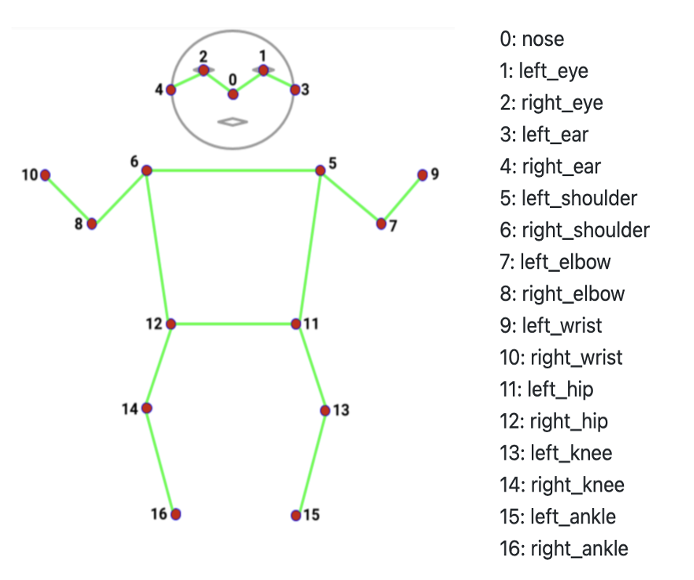
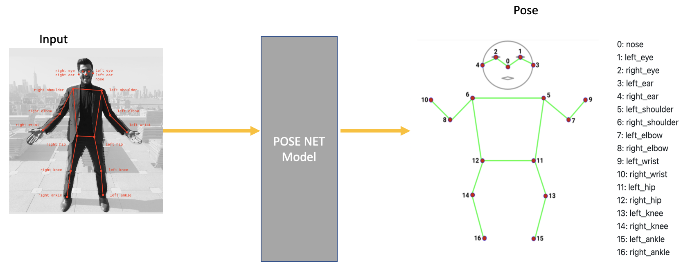
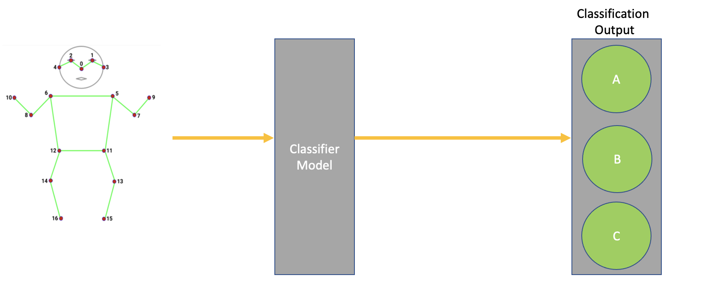
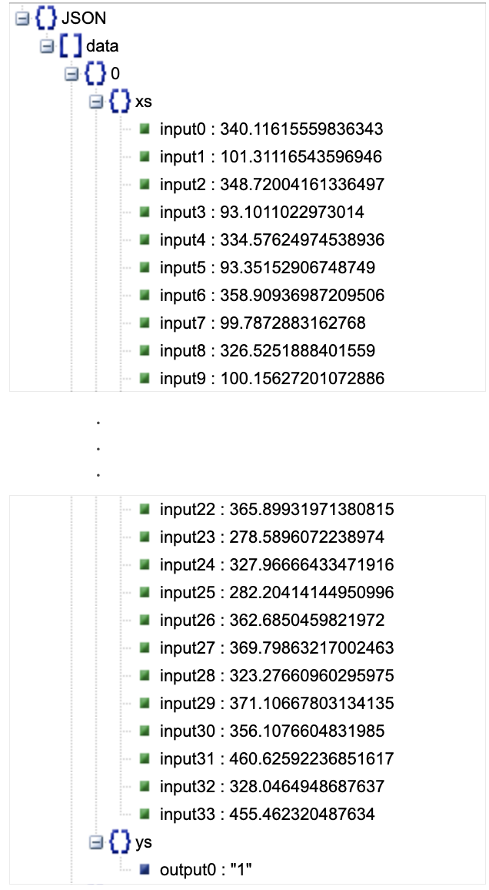
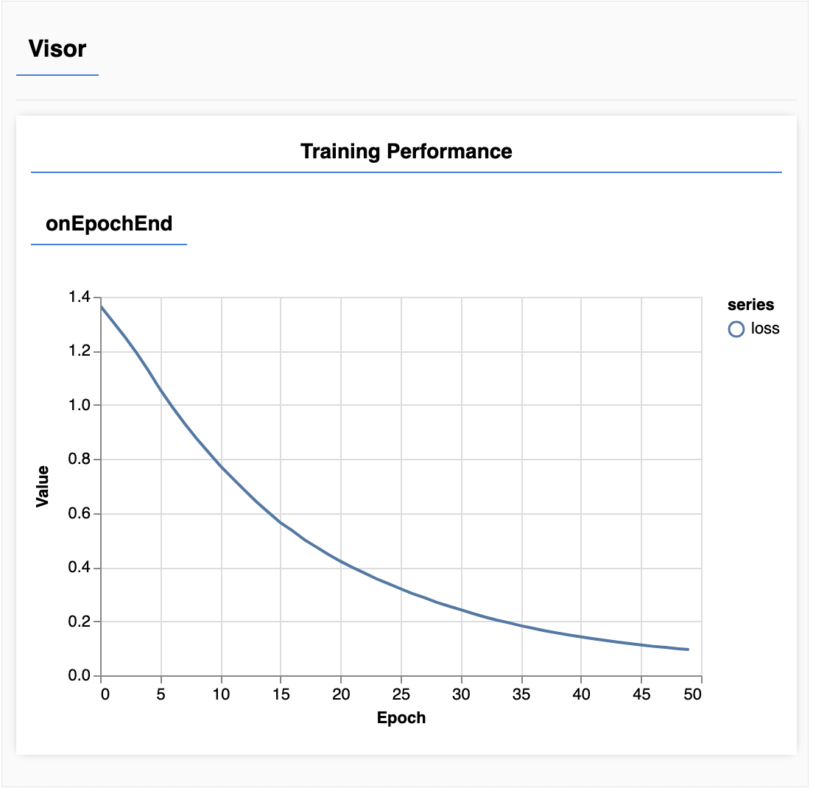

# Real-time Human Pose Estimation in the Browser with ml5.js and p5.js
In this project we can identify real time human pose, and we can identify how many times user did pushups, we can count how many seconds a person stands on a single foot. Try a live demo [here](https://posedetectionmodel.netlify.app/)

So What is Human pose estimation?
Pose estimation refers to computer vision techniques that detect human figures in images and video, so that one could determine, for example, where someone’s elbow shows up in an image.
To be clear, this technology is not recognizing who is in an image — there is no personal identifiable information associated to pose detection. The algorithm is simply estimating where key body joints are.

Below are the 3 Pose Estimation Pre trained Model We can go in details by using below link In our model we will go with PoseNet Model: 

#### MoveNet
MoveNet is an ultra fast and accurate model that detects 17 keypoints of a body.
It can run at 50+ fps on modern laptop and phones. [Demo](https://storage.googleapis.com/tfjs-models/demos/pose-detection/index.html?model=movenet)

#### BlazePose:
MediaPipe BlazePose can detect 33 keypoints, in addition to the 17 COCO keypoints,
it provides additional keypoints for face, hands and feet. [Demo](https://storage.googleapis.com/tfjs-models/demos/pose-detection/index.html?model=blazepose)

#### PoseNet
PoseNet can detect multiple poses, each pose contains 17 keypoints. [Demo](https://storage.googleapis.com/tfjs-models/demos/pose-detection/index.html?model=posenet)

# Introduction

PoseNet can be used to estimate either a single pose or multiple poses, meaning there is a version of the algorithm
that can detect only one person in an image/video and one version that can detect multiple persons in an image/video. So far we
will use the single person's Image/video to estimate the pose.

See the project live at: [https://posedetectionmodel.netlify.app]

------------------------------------------------------------------------

## How it Works 

### Input

In the first step of pose estimation, we will give an input to the posenet model. This input will be fed
through an image or a camera.This Input will be the base or our model.

### Pre Trained Model

In Next step the pre trained model that we have selected will take the input to process it further and will help us to identify the Key points
human body i.e Right Eye, Left Eye, Right wrist, Left Wrist etc.

### Output of PoseNet Model

Since the PoseNet model will help us to find the Key points and we will get this output in X,Y coordinates so
we will get  as output in 17 detection points with their X,Y coordinates value and probability which lying between 0-1.

### Classifier

The output that we have recieved from PoseNet Model in 2D array will convert into 1D array, In our case our out of 17 2d Array will get convert into 34 1D array,
and provide to ml5 classifier which will help us to identify the labeled pose from the classifier. 

#### Final Output

Since our classifier will help us to classify the pose under 3 labels "Namaste", "Salute", "Hi 5" which we fed as an output layer
So as a final output our model will tell us which pose is this. 

-----------------------------------------------------------------------------------------------------

Technical
-----------------------------------------------------------------------------------------------------
* PoseNet Model
	* Load posenet model
	* Got poses
		* draw poses and Skelton
	* Convert pose data into one dimensional array
	* Save data

* Classifier Model
	* Load data
	* Normalize data
	* Create classifier model
	* Train model with normalise data
	* Save trained model

* Classify Pose

Posenet Model Output
-----------------------------------------------------------------------------------------------------

Training Graph
-----------------------------------------------------------------------------------------------------

Resources 
-----------------------------------------------------------------------------------------------------
We have used below resources to create our model

## How Pose Estimation Model Working

https://www.youtube.com/watch?v=OIo-DIOkNVg&list=PLRqwX-V7Uu6YPSwT06y_AEYTqIwbeam3y&index=22

## How to create a Pose Estimation Model

https://www.youtube.com/watch?v=FYgYyq-xqAw&list=PLRqwX-V7Uu6YPSwT06y_AEYTqIwbeam3y&index=23

## How Pose Estimation Model used as a Yoga Trainer

https://www.youtube.com/watch?v=FYgYyq-xqAw&list=PLRqwX-V7Uu6YPSwT06y_AEYTqIwbeam3y&index=23

## How Pose Estimation Using the PoseNet Model

https://heartbeat.fritz.ai/human-pose-estimation-using-tensorflows-posenet-model-e5770f0a0a31

## Live URL: 
https://posedetectionmodel.netlify.app/

